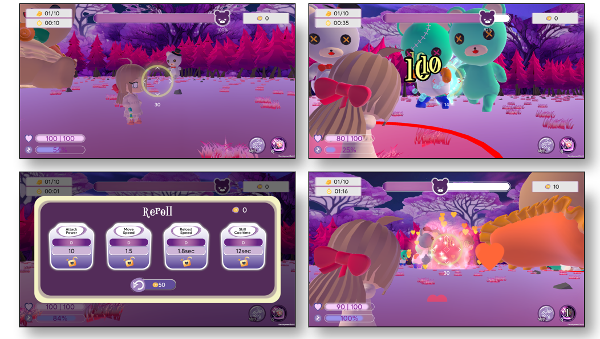

# BedTimeStory
### GameMakers 9기 게임잼 프로젝트 디벨롭
### 개발 기간 : 2024.11.09. ~ 2024.11.10 / 2025.01.19. ~ 2025.03.30.
### 출시 일자 : 2024.04.14.  [[스팀상점링크]](https://store.steampowered.com/app/3555050/BedTimeStory/)
----
#### 제가 작성한 코드만 업로드 하였습니다.
[[본 레포지토리 링크]](https://github.com/PakaDopa/BedTimeStory)
#### 다른 기여자가 있는 경우, 스크립트 상단에 주석으로 표시했습니다. 
#### 최종 업데이트 : 2025.04.09.
---
## [ 인게임 이미지 ]

---
## [ 본인 역할 ]
- **플레이어 애니메이션 시스템 구현**
  - 애니메이터 블렌드 트리로 플레이어의 이동속도와 이동방향에 따라 애니메이션이 자연스럽게 전환하도록 함
  - 애니메이터 레이어 마스크로 플레이어 상태별 애니메이션을 분리함
  - 애니메이션 이벤트로 플레이어의 발소리를 자연스럽게 재생함
  
- **플레이어 컨트롤러 리팩토링**
  - 신규 애니메이션 시스템 도입에 따라, PlayerController를 중심으로 한 중앙 통합 제어 구조로 리팩토링
  - 애니메이션, 능력치, 이동, 카메라 조작 등 세부 시스템은 PlayerController로부터 Input 이벤트를 의존성 주입(DI: Dependency Injection) 방식으로 전달받아 동작하도록 설계
    
- **최적화 연구**
  - 오브젝트 풀링 사용
  - 텍스처 압축으로 사용 메모리 및 빌드 용량 최적화
  - 오클루전 컬링 연구
    
- **메인 플로우 개발**
  - 스토리 컷씬 -> 로비 -> 게임 플레이(메인) ->게임 종료의 메인 시퀀스 개발
  - 게임 플레이 씬에서 난이도에 따라 스테이지를 세팅하고, 적이 등장하며, 승리 및 패배 조건을 감지하여 결과창으로 전환되는 시스템 구현

- **적 인공지능 / 전투시스템**
  - 추상클래스를 사용하여 4가지 종류(근접, 원거리, 탱커, 속도)의 적의 능력 구현
  - NavmeshAgent 컴포넌트를 사용한 이동 구현
  - 공격 기술의 피해 범위(AreaIndicator)를 표시하기위해 LineRenderer컴포넌트와 실시간 Mesh생성 기능 사용

- **협업 중심 구조 설계**
  - ScriptableObject와 외부 플러그인 Serializable Dictionary를 사용하여 비개발 직군도 편리하게 값을 수정할 수 있는 환경 구축
  - 난이도에 따른 적 생성 데이터 / 개체별, 난이도별 적 상세 능력치에 사용
    
- **설정 및 통계 시스템**
  - AudioMixer를 사용한 볼륨 조절, 마우스 민감도 조절 기능 개발
  - PlayerPrefs로 설정 저장
  - 상위 5개의 통계를 저장하고 테이블로 보여주는 대시보드 기능 개발
  - 통계는 JsonUtility와 IoSystem을 활용하여 저장/불러오기
  - 랭킹 데이터를 불러올 때, SystemInfo.deviceUniqueIdentifier를 사용하여, 데이터 무결성 검사 및 데이터 초기화 기능 개발

- **UI / 연출 일부**
  - Dotween과 Cinemachine Virtual Camera를 사용하여 게임 전반의 각 종 연출 구현 
  - 씬 전환간 페이드 인,아웃 / 사격 시 반동 효과 / 플레이어 피해효과 / 장전 효과 / 스킬 사용 효과 / 스킬 재사용 가능 효과 / 텍스트 효과 / 버튼 클릭 효과 등

---
## [ 구조도 ]
첫 번째 디렉토리는 사용되는 씬을 기준으로, 두 번째 디렉토리는 세부 기능별로 분류하였습니다.

<pre><code>
  📁 -1_Global
  📁 0_Story
  📁 1_Lobby
  📁 2_Main
  │ ├── 📁 System
  │ ├── 📁 UI
  │ ├── 📁 Tower
  │ ├── 📁 DropItem
  │ ├── 📁 Enemy
  │ ├── 📁 Player
  │ ├── 📁 AreaIndicator
  │ └── 📁 Effect
  📁 3_Result
  📁 99_Test
  </code></pre>
